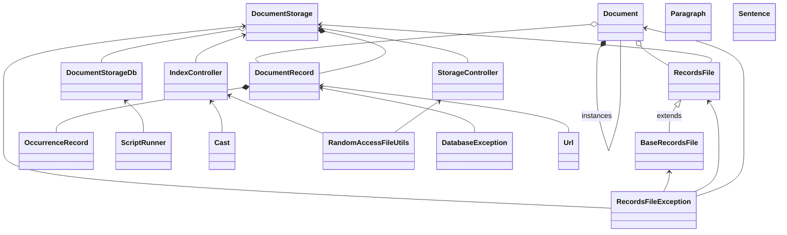

# Storage
Úložiště dokumentů pro účely pozdějšího získání originálního dokumentu v nemodifikovaném stavu. Dokumenty deduplikuje, ukládá, přiděluje unikátní
ID, umožňuje vyhledávat ID podle hashe dat dokumentu, ukládá metadata k jednotlivým výskytům dokumentu. 

## Typy entit
* Document - reprezentuje posloupnost bytů, která je v systému uložena, má unikátní ID a checksum, podle kterého ji lze vyhledat. Měla by ideálně mít také známý Content-type. Součástí je informace o uložení posloupnosti bytů:
  * jako data na nějakém místě ve vlastním úložišti (offset a délka, případně id souboru)
  * jako součást nějaké větší položky (ID položky, formát položky, lokalizace v rámci položky) - například příloha mailové zprávy
  * jako soubor na disku
  * jako soubor získatelný z nějakého URL
  * ??jako posloupnost několika menších položek (např. soubory v adresáři)
* DocumentOccurrence - spojení Document a metadat vztahujících se k jeho konkrétnímu výskytu. Zejména URL výskytu a ID instance Document. 

Ke každé instanci třídy Document existuje alespoň jedna instance třídy DocumentOccurrence. Pokud se stejný dokument vyskytl na více místech, ke každému takovému výskytu má existovat instance třídy DocumentOccurrence.

## API
API má umožňovat:
* uložení dokumentu a jeho výskytu
* získání uloženého dokumentu podle ID nebo checksumu
* získání dokumentu podle URL některého z jeho výskytů
* získání všech výskytů dokumentu s daným ID nebo checksumem
* odstranění výskytu dokumentu, a po odstranění posledního výskytu odstranění samotného dokumentu

## Implementace ukládání
* Defaultní způsob je uložení dat sekvenčně do souboru a zapamatování polohy a délky v něm (jako 2x 64bit int) v dalším souboru. Jako ID souboru by se pak dalo chápat pořadí v souboru poloh a velikostí. Pokud by nejvyšší bit polohy byl nastaven na 1 (záporná poloha), znamenalo by to, že soubor je uložen nějakým jiným způsobem a informace o poloze a délce se mají interpretovat jinak, což by se využilo u následujících možností (bylo by potřeba ještě stanovit, jak se pozná, o kterou možnost se jedná - třeba podle zbytku nejvyššího byte polohy).
* U součástí složených položek se může použít odkaz na správnou část složené položky.
* U souboru na disku se volitelně může použít jen informace, kde je na disku uložen.
* U souboru získatelného opakovaně z nějakého URL se volitelně může použít toto URL
* U dokumentu, který je složením více samostatně uložených položek (například adresář na disku) se volitelně může použít seznam těchto položek.

Objektově vzato by to byly různé implementace rozhraní pro získávání obsahu dokumentu.

## Class diagram

